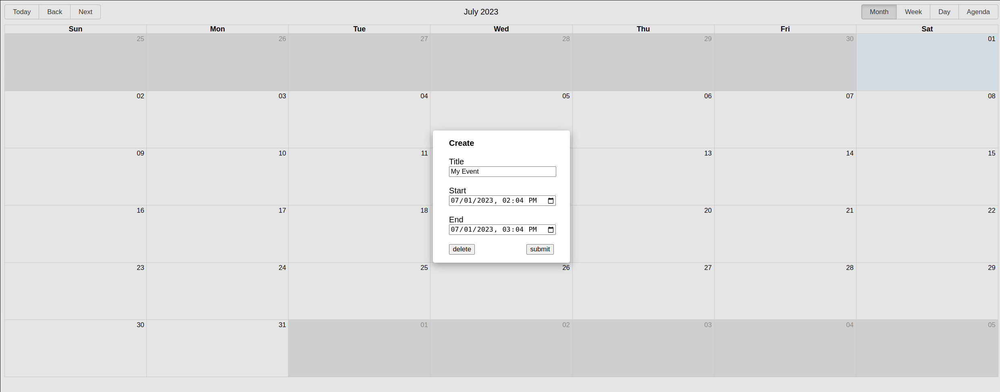
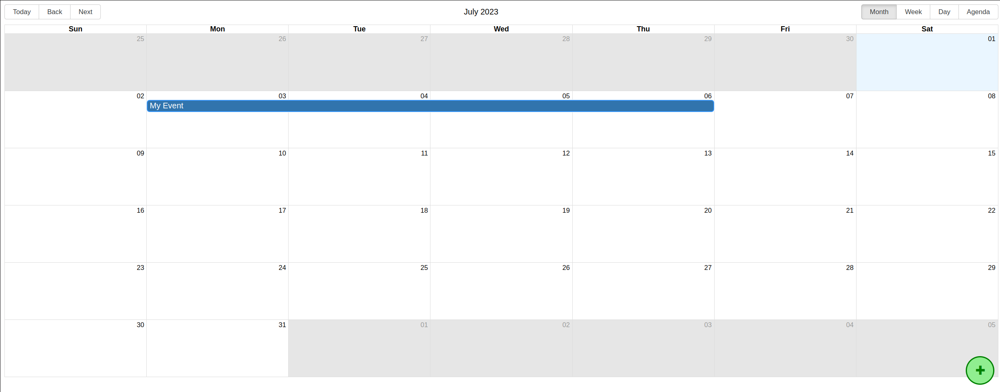
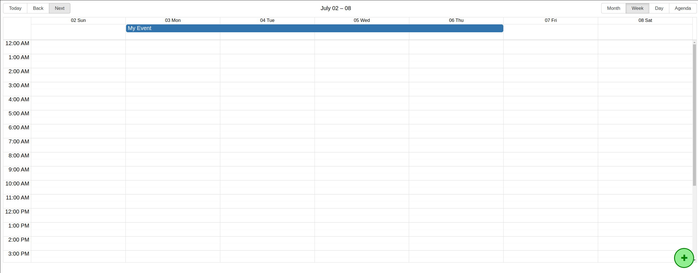
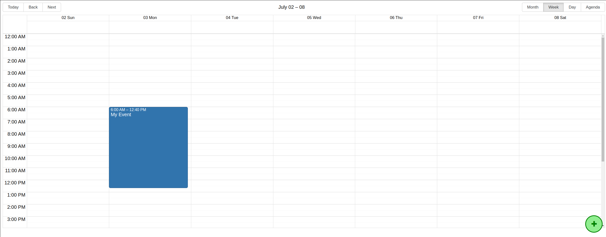

# Django Schedule

Provides a user-friendly interface for scheduling. Utilizes the `react-big-calendar` library to render a drag and drop calendar, where schedules are displayed and can be created, edited or deleted. The back-end is powered by `Django`, which listens to endpoints and stores the schedule data. Seamless integration of React.js and Django, providing a robust and efficient web application.

## Features

- Create, edit and delete schedules.
- Interactive drag and drop calendar interface.
- View modes by month, week or day.

## Prerequisites

Before running the Django Schedule project, make sure you have the following installed:

- [Node](https://nodejs.org/)
- [Python](https://www.python.org/)
- [Django](https://www.djangoproject.com/)

## Getting Started

Follow these steps to set up and run the project:

- From `back` directory:

  1.  Apply database migrations:

      ```sh
      python manage.py migrate
      ```

  2.  Start the development server:

      ```sh
      python manage.py runserver
      ```

- From `front` directory:

  1.  Install front-end dependencies:

      ```sh
      yarn
      ```

  2.  Run the code locally:

      ```sh
      yarn start
      ```

- Access [localhost](http://localhost:8000)

## Directories

- `back`: django server
- `front`: react app

```
.
├── back
│   ├── backend
│   └── schedule
└── front
    ├── public
    └── src
        ├── ctx
        └── ui
            ├── calendar
            └── crud
```

## Screenshots

### CRUD Modal

  

### Calendar Layout

  

### Week View Mode

  
  

## Instructions

Click over the event to open modal for edit or delete. Bottom right `+` button opens the same modal for creating a new schedule. Drag and drop schedules in order to simultaneously edit it's start/end date. Dragging it's edge instead of the entire container allows to edit start or end date separately.

## Acknowledgements

Django Schedule makes use of the following third-party content and open-source libraries:

- [Django](https://www.djangoproject.com/)
- [TypeScript](https://www.typescriptlang.org/)
- [React](https://reactjs.org/)
- [react-big-calendar](https://github.com/jquense/react-big-calendar)
- [Sass](https://sass-lang.com/)
- [Axios](https://axios-http.com/)
- [Moment.js](https://momentjs.com/)

Grateful to the contributors and maintainers of these projects for their valuable work. If you use any of these libraries, make sure to review and comply with their respective licenses and terms of use.

## Contributing

If you find a bug or have a suggestion, please open an issue. Feel free to reach out with any questions or feedback!
